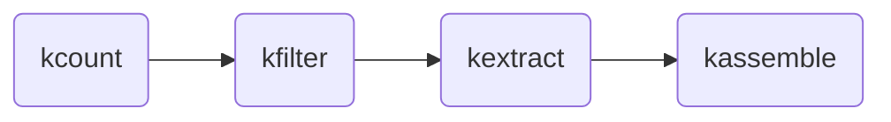

### Workflow diagram



### Study description

Explain and cite Amaranthus studies here...


### Get the fastq data
First we will download the fastq data files from NCBI. There are several ways
to do this, such as the sra-tools, but because these files are especially large
we will just use `wget` here. 

```bash
# make a directory for fastq data files
mkdir -p fastq_data/
URL="ftp://xxx.yyy.zzz"
wget $URL -O fastq_data/
```
??? abstract "wget stdout"
	```console
	...
	```

### Initialize a new project

```console
kmerkit init --name dioecy --workdir /tmp ./data/amaranth/*.gz
```

### Count kmers

```console
kmerkit count --json /tmp/dioecy.json --kmer-size 35 --min-depth 5 
```

??? abstract "kmerkit logged output"
	```console
	...
	```


### Filter kmers for those unique to males vs females

??? "Create a phenotype file (phenos.tsv)"
	This should be a tab (or any whitespace) separated values in a table with
	sample names in the first row (the column name for this row is ignored)
	and then trait values in subsequent columns. In the example below we
	will select the column "male" but it is fine for other columns of data
	to be present in the file which can be used in other steps (e.g., GWAS).

	```console

	name        trait
	sample-1	1
	sample-2	1
	sample-3	0
	sample-4	0
	...			
	```

```console
kmerkit filter \
	--json /tmp/dioecy.json \
	--trait trait.csv \
	--minmap 0.0 0.9 \            # kmer-freq>=0.9 of samples where trait=1
	--maxmap 0.1 1.0              # kmer-freq<=0.1 of samples where trait=0
```

??? abstract "kmerkit logged output"
	```console
	...
	```

The resulting files are KMC database files written with the name prefix `{workdir}/{name}-{sample-name}-kfilter.[pre,suf]`

??? info "peek at workdir file structure"
	```console
	.
	|---workdir
	    |
	    ------- a
	    |-------b
	    --------c
	    ...
	```


### Extract reads containing target kmers from samples

```console
kmerkit extract \
	--json /tmp/dioecy.json \
	--min-kmers-per-read 5 \
	./data/amaranths/*.gz
```

??? abstract "kmerkit logged output"
	```console
	...
	```


### Assemble contigs from extracted reads

```console
kmerkit assemble \
	--json /tmp/dioecy.json \
	--assembler
```

??? abstract "kmerkit logged output"
	```console
	...
	```
