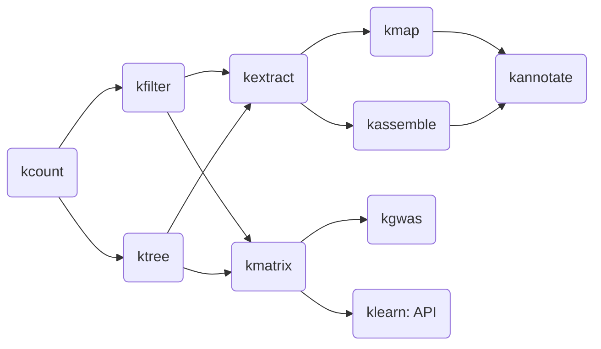

# Welcome to kmerkit

`kmerkit` is a toolkit for performing evolutionary analyses using 
kmer counts, frequencies, and comparisons with or without the 
context of a reference genome. It is both a stand-alone analysis framework 
as well as an extendable toolkit that can be incorporated into other 
software. The `kmerkit` tools are available as both a command-line interface
as well as a Python API.

